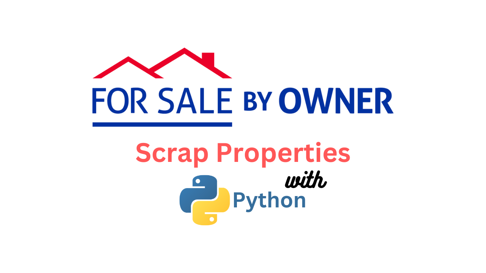

<br/>
<p align="center">
  <!-- <a href="https://github.com/mustafahubs/ForSaleByOwner-ScraperTool">
    
  </a> -->

  <h3 align="center">Python Scraper for Sale Listings on ForSaleByOwner.com</h3>

  <p align="center">
    A Useful Real Estate Property Scraping Tool and Easy Setup
    <br/>
    <br/>
    <a href="https://github.com/mustafahubs/ForSaleByOwner-ScraperTool">View Demo</a>
    .
    <a href="https://github.com/mustafahubs/ForSaleByOwner-ScraperTool/issues">Report Bug</a>
    .
    <a href="https://github.com/mustafahubs/ForSaleByOwner-ScraperTool/issues">Request Feature</a>
  </p>
</p>

     

## Table Of Contents

* [About the Project](#about-the-project)
* [Built With](#built-with)
* [Getting Started](#getting-started)
  * [Prerequisites](#prerequisites)
  * [Installation](#installation)
* [Usage](#usage)
* [Contributing](#contributing)
* [Authors](#authors)
* [Acknowledgements](#acknowledgements)

## About The Project



This project is a Python web scraper designed to extract sale listings data from the ForSaleByOwner website. By utilizing web scraping techniques, the scraper automates the process of gathering valuable information from the website, such as property details, pricing, location, and contact information.

## Built With

The project relies on the following Python libraries:

Requests: for making HTTP requests and retrieving HTML content.
CSV: for handling the data export functionality.
Prettytable: To show text on the terminal in tabular form.
pyinputplus: To get input from the user and validate it.

* [Requests](https://requests.readthedocs.io/en/latest/)
* [PrettyTable](https://pypi.org/project/prettytable/)
* [Pyinputplus](https://pypi.org/project/PyInputPlus/)

## Getting Started

This is an example of how you may give instructions on setting up your project locally.
To get a local copy up and running follow these simple example steps.

### Prerequisites

This is an example of how to list things you need to use the software and how to install them.

* npm

```sh
npm install npm@latest -g
```

### Installation

1. Get a free API Key at [https://example.com](https://example.com)

2. Clone the repo

```sh
git clone https://github.com/your_username_/Project-Name.git
```

3. Install NPM packages

```sh
npm install
```

4. Enter your API in `config.js`

```JS
const API_KEY = 'ENTER YOUR API';
```

## Usage

To use the scraper, simply run the Python script and provide the desired search parameters. The scraper will then navigate through the ForSaleByOwner website, extracting the relevant data and saving it to a CSV file. The extracted data can be easily accessed and analyzed using various data manipulation tools and techniques.

## Contributing

Contributions are what make the open source community such an amazing place to be learn, inspire, and create. Any contributions you make are **greatly appreciated**.
* If you have suggestions for adding or removing projects, feel free to [open an issue](https://github.com/mustafahubs/ForSaleByOwner-ScraperTool/issues/new) to discuss it, or directly create a pull request after you edit the *README.md* file with necessary changes.
* Please make sure you check your spelling and grammar.
* Create individual PR for each suggestion.
* Please also read through the [Code Of Conduct](https://github.com/mustafahubs/ForSaleByOwner-ScraperTool/blob/main/CODE_OF_CONDUCT.md) before posting your first idea as well.

### Creating A Pull Request

Contributions to this project are welcome! If you have any ideas for improvements or additional features, feel free to fork the repository and submit a pull request. Please make sure to follow the project's coding style and guidelines when contributing. You can

1. Fork the Project
2. Create your Feature Branch (`git checkout -b feature/AmazingFeature`)
3. Commit your Changes (`git commit -m 'Add some AmazingFeature'`)
4. Push to the Branch (`git push origin feature/AmazingFeature`)
5. Open a Pull Request

## Authors

* **Mustafa** - *Software Developer* - [Mustafa](https://github.com/mustafahubs/) - *Built ReadMe Template*

## Acknowledgements

* [MustafaHubs](https://github.com/Mustafahubs/)
* [ImgShields](https://shields.io/)
* []()
